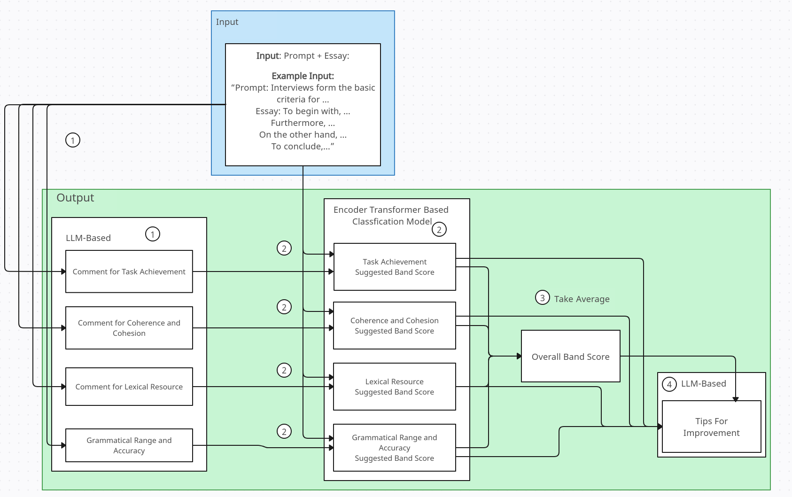
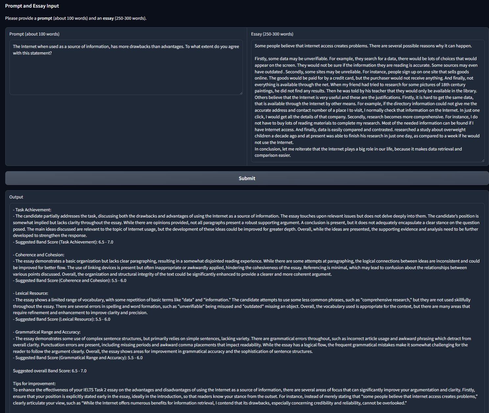

# IELTS Writing Helper
A tool that automatically evaluate your essay and provide helpful tips for improvement.


### Usage

**Mode 1**: Band score is given by a encoder-only transformer classifier

```bash
cd final_assemble
python encoder_base.py
```

**Mode 2**: Everything LLM-based

```bash
cd final_assemble
python LLM_base.py
```

It will start a Gradio web-based UI server. Follow the message to open IELTS Writing Helper in browser:

```
Running on local URL:  http://127.0.0.1:xxxx
```


### Architecture



For **mode 2**: The box with circle 2 is also LLM-based. 


### Gallery


